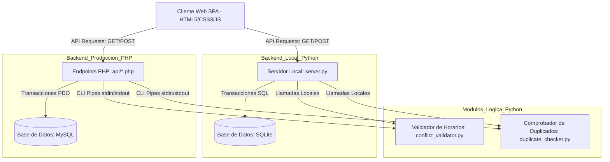

# Bitácora de Avance y Diseño Técnico: LogiFamily
**Proyecto de Título - Gestión de Calendario Compartido y Lista de Compras Familiar**

Este documento recopila el diseño técnico, la arquitectura de software y el registro de desarrollo del proyecto para servir como base de la memoria de titulación y la presentación ante la comisión académica.

---

## 1. Objetivos del Proyecto

### Objetivo General
Desarrollar una aplicación web interactiva para la gestión de calendarios compartidos y listas de compras, que permita centralizar la información logística familiar y asegurar la consistencia de los datos mediante validaciones de programación avanzada.

### Objetivos Específicos
1. **Interfaz Responsiva**: Diseñar e implementar una interfaz SPA (Single Page Application) utilizando HTML5 semántico y CSS3 (Mobile First) con variables de color HSL y transiciones suaves para su adaptación a dispositivos móviles y de escritorio.
2. **Persistencia Relacional**: Modelar y estructurar bases de datos relacionales equivalentes en MySQL y SQLite para el almacenamiento estructurado y seguro de usuarios, eventos, grupos e insumos.
3. **Backend Híbrido**: Crear una lógica de backend que combine la versatilidad de PHP para enrutamiento y accesos CRUD, con la potencia de procesamiento lógico de Python para algoritmos de detección de traslapes en agendas y coincidencia difusa en compras.
4. **Validación y Concurrencia**: Proteger el sistema ante accesos concurrentes no coordinados implementando Bloqueo Optimista (Optimistic Concurrency Control) y transacciones seguras de base de datos.
5. **Garantía de Calidad**: Validar la fiabilidad mediante scripts de prueba de estrés multihilo que simulen cargas concurrentes críticas.

---

## 2. Arquitectura de Software

El sistema adopta una arquitectura desacoplada basada en servicios API REST. El frontend interactúa mediante solicitudes HTTP asíncronas (`Fetch API`) que devuelven respuestas en formato JSON.

### Diagrama de Flujo de Datos



---

## 3. Modelo de Base de Datos (Relacional)

El diseño relacional se compone de 6 tablas con llaves foráneas en cascada e índices orientados al rendimiento en consultas de rango.

```
usuarios (id, nombre, email, password, fecha_creacion)
  ├─ miembros_grupo (grupo_id [FK], usuario_id [FK], rol, fecha_union)
  │    └─ grupos (id, nombre, codigo_acceso, fecha_creacion)
  │         ├─ eventos (id, grupo_id [FK], titulo, descripcion, fecha_inicio, fecha_fin, categoria, creado_por [FK], version)
  │         ├─ listas_compras (id, grupo_id [FK], nombre, fecha_creacion)
  │         │    └─ items_compra (id, lista_id [FK], nombre, cantidad, unidad, comprado, actualizado_por [FK], version)
  │         └─ turnos (id, grupo_id [FK], usuario_id [FK], fecha, tipo)
```

### Descripción de Tablas Principales:
*   **usuarios**: Almacena los perfiles del hogar. La contraseña se hashea con algoritmos criptográficos (`bcrypt` en PHP o `SHA-256/bcrypt` en Python).
*   **miembros_grupo**: Tabla intermedia N-a-N que asocia usuarios con grupos de hogar, definiendo roles administrativos ('admin', 'miembro').
*   **eventos**: Contiene la agenda familiar. Dispone de un índice compuesto sobre `(grupo_id, fecha_inicio, fecha_fin)` para acelerar la validación de solapamientos. Cuenta con un campo `version` para control de concurrencia.
*   **items_compra**: Artículos del hogar. Posee el campo `comprado` (booleano) y `version` para control de concurrencia optimista al marcar artículos al mismo tiempo desde múltiples teléfonos móviles.
*   **turnos**: Asigna turnos laborales/hogareños rotativos ('manana', 'tarde', 'noche', 'libre') por usuario y fecha. Posee una restricción `UNIQUE(usuario_id, fecha)` para evitar la asignación de múltiples turnos a un mismo usuario en el mismo día.

---

## 4. Lógica de Programación Avanzada e Integración

### A. Validación de Traslapes de Horario (Python)
Cuando un miembro de la familia agenda o edita un evento, el sistema ejecuta el script `backend/conflict_validator.py`.
1.  **Detección de traslape absoluto**: Comprueba si existe algún evento en el grupo donde se cumpla matemáticamente la condición:
    $$\text{InicioPropuesto} < \text{FinExistente} \quad \land \quad \text{InicioExistente} < \text{FinPropuesto}$$
2.  **Advertencia de proximidad**: Si no hay traslape, evalúa si la separación entre eventos es menor a 15 minutos, alertando al usuario en pantalla para evitar agendas demasiado ajustadas.
3.  **Generador de Alternativas**: Si se detecta un conflicto, calcula dinámicamente huecos libres en el mismo día y sugiere hasta dos franjas horarias alternativas listas para ser seleccionadas por el usuario.

### B. Comprobador de Artículos Duplicados (Python)
Para prevenir que dos personas agreguen el mismo insumo con nombres levemente distintos (por ejemplo, "Leche semidescremada" y "leche semi-descremada"), `backend/duplicate_checker.py` procesa los artículos activos:
*   Normaliza el texto (minúsculas, remoción de espacios innecesarios y eliminación de acentos).
*   Utiliza el algoritmo de coincidencia difusa de `difflib.SequenceMatcher` para calcular un ratio de similitud (umbral de tolerancia por defecto = 0.75).
*   Si se detecta similitud, la interfaz muestra una advertencia de confirmación antes de proceder con el guardado.

### C. Mecanismo de Integración Híbrido (Piping CLI)
La API de PHP ejecuta los validadores de Python en segundo plano de manera segura mediante comunicación bidireccional por tuberías:
```php
$process = proc_open('python backend/conflict_validator.py', $descriptorspec, $pipes);
// Se escribe el payload JSON en la entrada estándar (stdin) de Python
fwrite($pipes[0], $jsonPayload);
// Se lee el dictamen JSON desde la salida estándar (stdout) de Python
$stdout = stream_get_contents($pipes[1]);
```
Esto permite mantener el backend de PHP completamente limpio y desacoplado, derivando cálculos lógicos pesados a los scripts especializados en Python.

### D. Pintor Rápido de Turnos y Detección de Festivos
Se ha incorporado un sistema ágil para la administración de turnos rotativos familiares y la detección de festivos:
1.  **Detección de Festivos**: El sistema mapea automáticamente los días festivos fijos y móviles del año 2026, destacando visualmente los fines de semana y días feriados en rojo e imputando etiquetas informativas sutiles.
2.  **Pintor Rápido de Turnos (UX)**: Permite seleccionar un tipo de turno en la barra de herramientas ('Mañana', 'Tarde', 'Noche', 'Libre', 'Borrar') y asignarlo al instante haciendo clic directamente sobre las celdas del calendario.
3.  **Operación Asíncrona Táctica**: La interfaz realiza cambios en caliente en el frontend de manera inmediata (optimistic UI rendering) para una sensación fluida y táctil, mientras sincroniza por detrás con la API REST (`POST /api/shifts.php?action=set`). Si la API falla, el estado se revierte automáticamente.

---

## 5. Control de Concurrencia Avanzado

Para prevenir que actualizaciones simultáneas (por ejemplo, dos padres intentando marcar un artículo como "comprado" o editando un evento al mismo tiempo) generen inconsistencias, se aplican dos técnicas combinadas:

### 1. Transacciones ACID de Base de Datos
Tanto en PHP (PDO) como en Python (sqlite3), las escrituras se realizan abriendo transacciones explícitas (`BEGIN TRANSACTION`). Si alguna inserción o comprobación secundaria falla, se ejecuta un `ROLLBACK` total, asegurando que la base de datos nunca quede en un estado corrupto o inconsistente.

### 2. Bloqueo Optimista (Optimistic Concurrency Control)
Cada registro de evento o artículo posee una columna `version` (entero).
1.  Al cargar los datos, el cliente SPA obtiene el registro con su `version` actual (ej. `version = 1`).
2.  Al enviar la actualización, el cliente devuelve ese número de versión.
3.  El servidor ejecuta el comando de actualización validando la coincidencia de versión en la cláusula `WHERE`:
    ```sql
    UPDATE items_compra 
    SET comprado = 1, version = version + 1 
    WHERE id = :id AND version = :current_version;
    ```
4.  Si otro usuario actualizó el registro una milésima de segundo antes, el número de versión en la base de datos ya habrá cambiado a `2`. Por ende, el comando afectará a `0` filas.
5.  Al detectar `0` filas afectadas, el servidor cancela la operación, ejecuta un rollback y devuelve un error de concurrencia asíncrono al cliente, quien notifica al usuario pidiéndole recargar los datos para evitar sobreescrituras ciegas.

---

## 6. Pruebas de Estrés y Validación

Para simular la robustez del sistema bajo carga familiar real, el archivo `tests/stress_test.py` utiliza hilos concurrentes para saturar el servidor local:
*   Se lanzan 15 hilos en paralelo intentando reservar la misma franja de 1 hora del calendario al mismo tiempo.
*   **Resultados Esperados**: Gracias al validador de Python y a las transacciones de base de datos, el sistema permite registrar exactamente 1 evento con éxito (200 OK) y rechaza o marca como conflicto las otras 14 solicitudes simultáneas, previniendo sobreescrituras o duplicidades críticas de horario.

---

## 7. Guía de Ejecución

### Opción A: Servidor Local Rápido (Python + SQLite)
Ideal para defensas locales rápidas y pruebas del día a día, ya que no requiere configuración de servidores web externos ni motores de bases de datos.
1.  Asegúrate de estar en el directorio raíz del proyecto: `c:\Users\ac42028\Documents\Calendario compartido`
2.  Ejecuta el servidor:
    ```bash
    python server.py
    ```
3.  Abre el navegador e ingresa a: `http://localhost:8000`
4.  Prueba las cuentas semilla (Contraseña para todas: `password123`):
    *   `maria@familia.com` (Mamá María)
    *   `juan@familia.com` (Papá Juan)

### Opción B: Producción (Apache/PHP + MySQL)
Para el despliegue final en la nube o en servidores locales de prueba (como XAMPP/Laragon).
1.  Importa el esquema relacional `database/schema.sql` en tu gestor de base de datos MySQL (por ejemplo, phpMyAdmin).
2.  Configura las credenciales de conexión en `api/config.php` si tu MySQL tiene usuario o contraseña diferente.
3.  Copia todo el contenido del proyecto a la carpeta raíz de tu servidor web (por ejemplo, `C:\xampp\htdocs\calendario_compartido`).
4.  Abre la aplicación desde la dirección web local configurada (ej. `http://localhost/calendario_compartido`).
